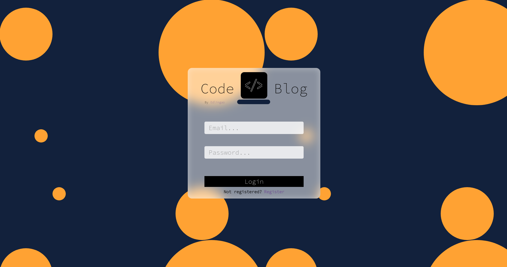
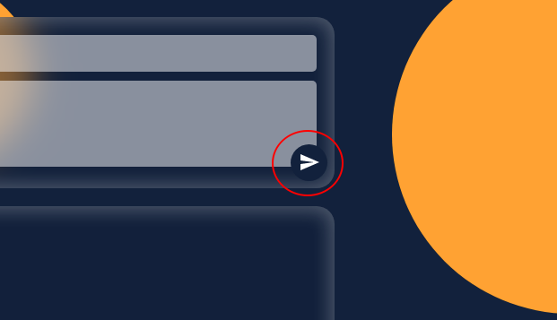
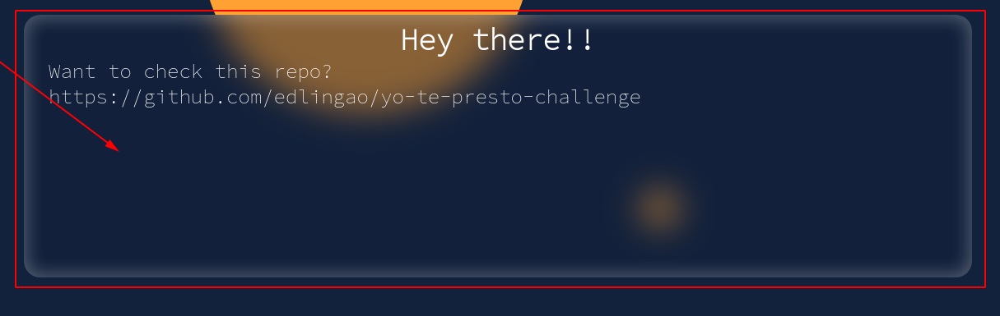
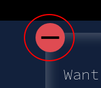
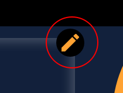
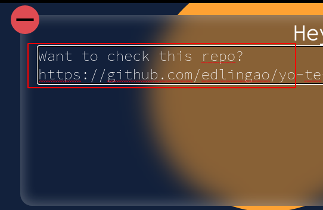
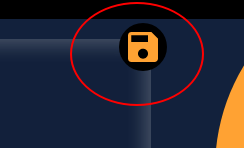
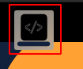

# CodeBlog

## Important notes
The following are some instructions on how to use correctly this test

> ## How to save a post
To save a post you should fill the title and comment boxes and then click on the send icon AKA:

> ## How to open a post
To open a post just simply click on the post you would like to see

> ## How to delete a post
To delete a post just click on the red minus sign on the "single post" view

> ## How to edit a post
To edit a post you would have to make a series of steps
> - First, you click the pencil icon
> - 
> - It will automatically focus the title section, you can edit the title there
> - 
> - Then, if you need to, click on the comment section to edit its content as well
> - 
> - ## Now finally you can just click the save button to update your post
> - 
> ## How to logout
Just click the logout button located on the top right corner

> ## How to go back to the main view
Just click the Code Blog logo to go back to the root page

## This is a project challenge for the startup YoTePresto!
I hope you guys like it! :D/
## Available Scripts

In the project directory, you can run:

### `npm start`

Runs the app in the development mode. 
Open [http://localhost:3000](http://localhost:3000) to view it in the browser.

The page will reload if you make edits. 
You will also see any lint errors in the console.

### `npm test`

Launches the test runner in the interactive watch mode. 
See the section about [running tests](https://facebook.github.io/create-react-app/docs/running-tests) for more information.
